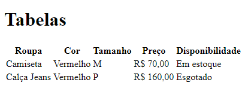

<h1 align="center">Tabela Simples</h1>

  
  

### Descrição do Projeto
Este é um exemplo simples de uma página HTML que demonstra o uso de tabelas. O projeto faz parte do curso DevQuest e visa ensinar aos alunos como criar e estruturar tabelas básicas em HTML.

A página apresenta uma tabela com informações sobre diferentes peças de roupa, incluindo o nome da peça, cor, tamanho, preço e disponibilidade em estoque. Cada linha da tabela representa uma peça de roupa, com as informações organizadas em colunas.

Este projeto fornece uma introdução simples, mas eficaz, ao uso de tabelas em HTML, demonstrando como organizar e exibir dados tabulares em uma página da web.

### 🛠 Tecnologias

As seguintes ferramentas foram usadas na construção do projeto:

- HTML

